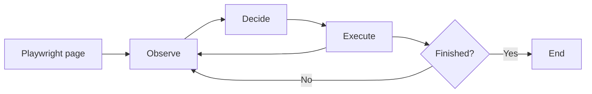

# autoQA

An opinionated browser QA agent for real workflows, not a demo wrapper around an LLM. It launches Playwright, reads the page as structured signal, and loops through observe, decide, and execute until the objective is done.

The focus is narrow and practical: catch what the page is actually doing, decide the next move with an LLM, and keep the run grounded in the browser state, console output, network activity, and transient UI feedback.

## Why this exists

Most browser agents fail in the same places: they miss transient state, lose track of what happened, or treat the DOM like a flat blob of text. autoQA is built to stay closer to the execution surface.

It captures the signals that matter to a test run:

- page structure as a DOM/AST representation with stable `agentId` anchors
- console messages and page errors
- relevant network activity such as fetch, XHR, document, and websocket traffic
- transient UI messages such as toasts, banners, alerts, and status updates

That is enough to make the agent useful on real frontends without pretending it has superpowers it does not have.

## How it works



The runtime is a LangGraph state machine defined in `src/index.ts`:

- `observeNode` turns the current browser state into structured context.
- `decideNode` asks the configured LLM what to do next.
- `executeNode` performs the selected action and updates the state.

The agent keeps looping until the objective is completed or the recursion limit is reached.

## What it can do

The toolset is intentionally concrete:

- click elements by `agentId`
- fill single fields or multiple fields in one shot
- upload files
- select dropdown options
- press Enter
- navigate to URLs
- wait for dynamic content to settle
- inspect captured network and console logs
- inspect captured transient UI messages
- send a summary email
- mark the run as done when the objective is complete

That is the real surface area of the agent. If a new capability is not in the code, it is not claimed here.

## Supported models

The entry point currently defaults to `ollama`, but the project is wired for these providers through `modelController`:

- OpenAI
- Anthropic
- Google
- Ollama
- LM Studio

If the selected model does not support native tool calling, startup fails early.

## Repository layout

- `src/index.ts` wires the graph, browser lifecycle, and capture modules.
- `src/nodes/` contains the observe/decide/execute loop.
- `src/tools/browser/` defines browser actions and inspection tools.
- `src/tools/miscellaneus/` contains general actions such as email and completion.
- `src/networkCapture.ts`, `src/consoleCapture.ts`, and `src/uiSignalCapture.ts` collect the runtime signals the agent reasons over.
- `src/ast.ts`, `src/locators.ts`, `src/domains.ts`, and related modules shape the page model.

## Requirements

- Node.js 20 or newer
- npm
- A Playwright-compatible browser environment

## Run locally

```bash
npm install
```

Development:

```bash
npm run dev
```

Build:

```bash
npm run build
```

Start the compiled output:

```bash
npm start
```

## Configuration

The agent reads its runtime configuration from environment variables and the provider setup in `src/index.ts`.

- `OBJECTIVE` sets the task the agent should complete.
- `RECURSION_LIMIT` caps the graph loop depth.
- `HEADLESS` is currently hardcoded to `false` in the entry point.

Provider-specific credentials should be set in `.env` when needed by the selected backend.

## Project status

This codebase is aimed at people who want a transparent, inspectable agent rather than a platform abstraction. The implementation favors explicit browser actions, observable state, and a small number of well-defined tools.

## License

Licensed under the Apache License, Version 2.0. See [LICENSE](LICENSE).