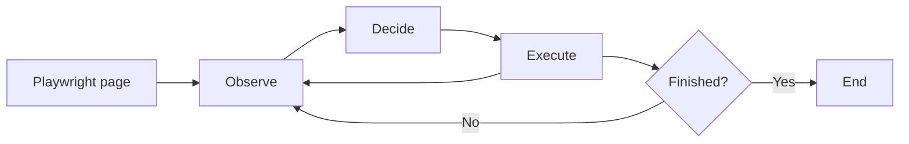

# AutoQA

> Spot bugs before yours users do.

## Why it exists
Nowadays software is shipped faster than ever, but the QA process is often still manual and slow. autoQA is designed to help teams catch regressions early by running automated tests in a real browser environment, guided by an LLM.


## Why AutoQA
- **It's Open source:** (released under **Apache 2.0**) and self-hostable.

- **LLM Agnostic:** You can use any LLM provider that supports tool calling, including OpenAI, Anthropic, Google, Ollama, and LM Studio.  

- **Privacy oriented:** Thanks to Ollama and LM Studio, you can run the agent fully offline without sending your data to a third-party cloud provider without big performance trade-offs.

- **It can be run on every OS**, including Windows, macOS, and Linux (Powered by NodeJS).

- **It can be run on servers without a GUI** (headless) or with a visible browser window directly on your PC.

- **DOM TREE driven:** The agent operates based on a structured and polished representation of the page's DOM, ensuring accurate interaction with UI elements contextualized within their surrounding context and to-do tasks and you don't rely on vision models.

- **(CaTB) Commits as Tests Books:** your commits become test books, centralized in your GIT repository, where AutoQA and other humans can read them to test apps. 

- **Vertical on Quality Assurance, but suitable for RPA:** AutoQA is designed to be a QA tool, but it can also be used for Robotic Process Automation (RPA) tasks, such as filling forms, navigating websites, and performing repetitive actions.

## How it works under the hood:


```mermaid
flowchart LR
	A[Playwright page] --> B[Observe]
	B --> C[Decide]
	C --> D[Execute]
	D --> B
	D --> E{Finished?}
	E -->|No| B
	E -->|Yes| F[End]
```

The runtime is a LangGraph state machine defined in `src/index.ts`:

- `observeNode` turns the current browser state into structured context.
- `decideNode` asks the configured LLM what to do next.
- `executeNode` performs the selected action and updates the state.

The agent keeps looping until the objective is completed or the recursion limit is reached.

### DOM Tree model

`observeNode` generates a simplified AST from the live page and `decideNode` converts it into a compact tree sent to the model.

The compact tree is intentionally structured and denoised:

- interactive and actionable elements first
- key attributes only (`type`, `name`, `placeholder`, `aria-label`, `role`, `value`, `selected`, `options`, `href`, `src`)
- derived label/context from nearby semantic hints
- significant container ancestors to preserve local context
- deduplication and bounded size to avoid prompt bloat
- normalized CSS class aliases (`class1`, `class2`, ...) to reduce noisy dynamic class names

For `<select>` controls, options are serialized as `value=>label` pairs to help the LLM choose the correct value.

## What it can do

The toolset is intentionally concrete:

- click elements using real HTML target attributes (`id`, `name`, `placeholder`, `aria-label`, `role`, `text`, `href`, `tag`, optional CSS)
- fill single fields or multiple fields in one shot
- upload files
- select dropdown options
- press Enter
- navigate to URLs
- wait for dynamic content to settle
- inspect captured network and console logs
- inspect captured transient UI messages
- send a summary email
- mark the run as done when the objective is complete

## Supported models

The entry point currently defaults to `ollama`, but the project is wired for these providers through `modelController`:

- OpenAI
- Anthropic
- Google
- Ollama
- LM Studio

If the selected model does not support native tool calling, startup fails early.

## Requirements to run

- Node.js 20 or newer
- npm
- A Playwright-compatible browser environment

## Setup API keys and provider

### Step 1: Choose your LLM Provider

Set the `LLM` environment variable to one of the supported providers:

```bash
# Supported values: ollama | openai | anthropic | google | lmstudio
LLM="ollama"
```

### Step 2: Configure the selected provider

#### If using **Ollama** (Recommended for privacy)

1. **Start the Ollama server locally** (REQUIRED - or you'll get fetch errors):
   ```bash
   ollama serve
   ```

2. **Optional:** Use a remote Ollama server or cloud API:
   ```bash
   OLLAMA_BASE_URL="http://localhost:11434"
   or
   OLLAMA_BASE_URL="https://api.ollama.com"  # If using cloud-hosted Ollama
   OLLAMA_API_KEY="your-api-key"  # If using cloud-hosted Ollama
   ```

3. Set the model (optional):
   ```bash
   LLM_MODEL="gemma4:31b-cloud"
   ```

#### If using **OpenAI**

1. **Required:** Set your API key in `.env`:
   ```bash
   OPENAI_API_KEY="sk-your-key-here"
   ```

2. Set the model (optional):
   ```bash
   LLM_MODEL="gpt-4o"
   ```

#### If using **Anthropic**

1. **Required:** Set your API key in `.env`:
   ```bash
   ANTHROPIC_API_KEY="sk-ant-your-key-here"
   ```

2. Set the model (optional):
   ```bash
   LLM_MODEL="claude-3-5-sonnet-20240620"
   ```

#### If using **Google**

1. **Required:** Set your API key in `.env`:
   ```bash
   GOOGLE_API_KEY="your-google-api-key"
   ```

2. Set the model (optional):
   ```bash
   LLM_MODEL="gemma-4-31b-it"
   ```

#### If using **LM Studio**

1. **Required:** Start the LM Studio server locally

2. Set the model (optional):
   ```bash
   LLM_MODEL="your-local-model-name"
   ```

## Configuration

Install npm dependencies:
```bash
npm install
```

Install Playwright browsers:
```bash
npx playwright install
```

The agent reads its runtime configuration from environment variables and the provider setup in `src/index.ts`.

- `OBJECTIVE` sets the task the agent should complete.
- `RECURSION_LIMIT` caps the graph loop depth.
- `HEADLESS` is currently hardcoded to `false` in the entry point.

Provider-specific credentials should be set in `.env` when needed by the selected backend.

## Quality Assurance automation via Webhook trigger (GitHub/GitLab also on premise)

The project includes a webhook server in [src/git.ts](src/git.ts) that listens for push events and starts the agent when commit messages contain an `autoQA:` instruction.

Example commit message:

```text
your commit message here...

... autoQA: go on https://my-app.example.com and register with random credentials, then verify you can add a new "Immobile"
```

Available webhook endpoints:

- `POST /webhooks/github`
- `POST /webhooks/gitlab`
- `POST /webhooks/gitlab/onprem`

Run it locally:

```bash
npm run dev:webhook
```

Build and run production output:

```bash
npm run build
npm run start:webhook
```

Environment variables:

- `WEBHOOK_PORT` default `8787`
- `GITHUB_WEBHOOK_SECRET` required for GitHub signature validation (`X-Hub-Signature-256`)
- `GITLAB_WEBHOOK_TOKEN` required for GitLab token validation (`X-Gitlab-Token`)
- `GITLAB_ONPREM_WEBHOOK_TOKEN` optional dedicated token for on-prem endpoint
- `GITLAB_ONPREM_BASE_URL` optional allowlist prefix for on-prem project URL (`project.web_url`)
- `HEADLESS` recommended `true` in server/cloud environments
- `RECURSION_LIMIT` optional agent loop cap

## Run it locally for designed task (RPA or QA)

Development:

```bash
npm run dev
```

Build:

```bash
npm run build
```

Start the compiled output:

```bash
npm start
```


## Notes:
- Only push events are processed.
- The webhook runner executes objectives sequentially (queue) to avoid multiple Playwright sessions colliding.
- If no `autoQA:` instruction is found in pushed commits, the event is accepted but no run is queued.

## Project status

This codebase is aimed at people who want a transparent, inspectable agent rather than a platform abstraction. The implementation favors explicit browser actions, observable state, and a small number of well-defined tools.

## Say thanks

If you find this project useful, please consider starring it on GitHub or sharing it with your colleagues. Your support helps me continue to improve and maintain AutoQA.

## License

Licensed under the Apache License, Version 2.0. See [LICENSE](LICENSE).